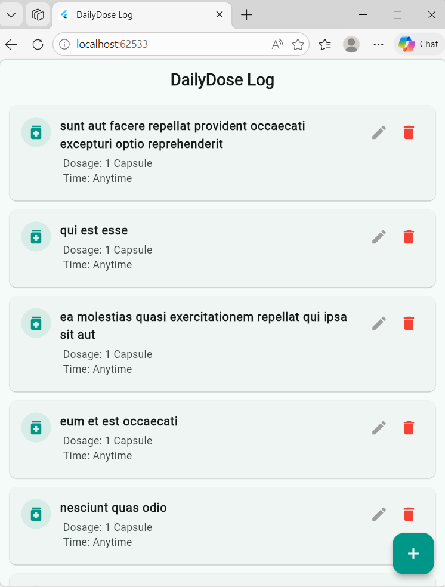
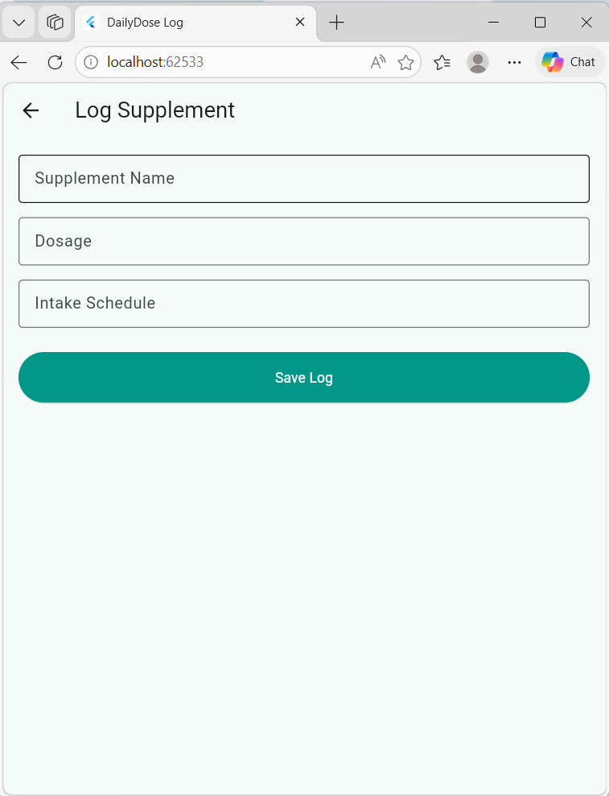
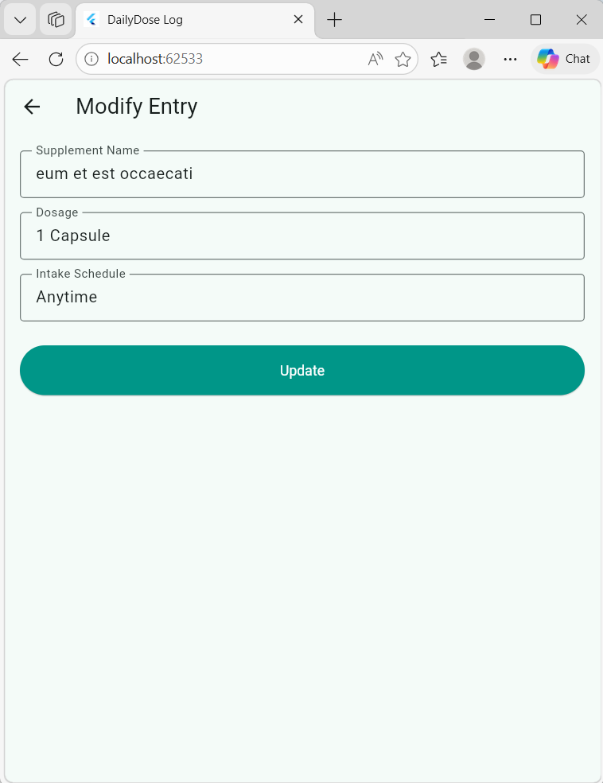

## Mufarihat Tadesse Begashaw, Section 1, UGR/9735/16

## DailyDose Medication Tracker
An enterprise-grade personal health companion 
application developed to log and monitor daily
vitamin or supplement schedules. This project 
highlights asynchronous multi-state transitions
using an event-driven framework interacting with a mock backend.

## Architectural Features
- **State Management**: Built on the latest `flutter_bloc` pattern. State logic is split into event declarations (`SupplementEvent`) and deterministic states (`SupplementState`).
- **Advanced Networking**: Powered by the `dio` package, utilizing a central, streamlined network client configuration with global timeouts.

## To run the application locally
   run  flutter pub get || flutter pub add dio flutter_bloc equatable
    and flutter run
   
## Screenshots of the running application

